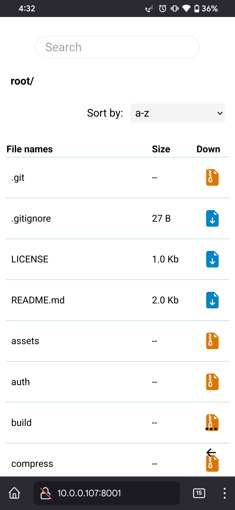
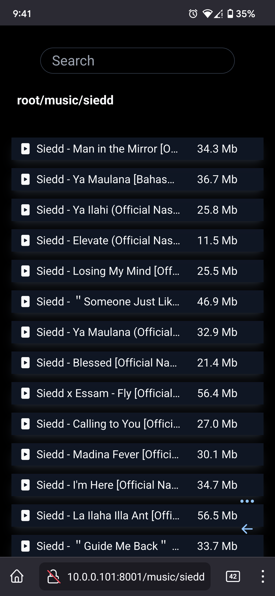

# GoShare

is a file server or sharer.

## Fetures

- Add passowrd
- Super fast
- Nice ui
- Cli interface
- For styling tailwincss was used
- and so on..

## usages

```bash
git clone --depth 1 https://github.com/wizsk/goshare/
cd goshare
go run . -d [directory path] # -p [passowrd] -- port [port number]
```

## Screenshots

## auth


### Light


### Dark


### Mobile

<table>
  <tr>
    <td> </td>
    <td></td>
   </tr> 
  </tr>
</table>
